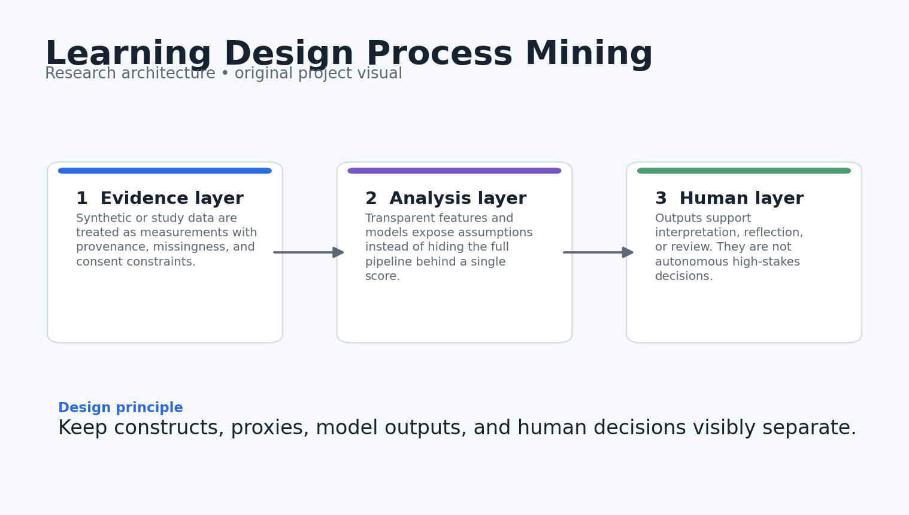
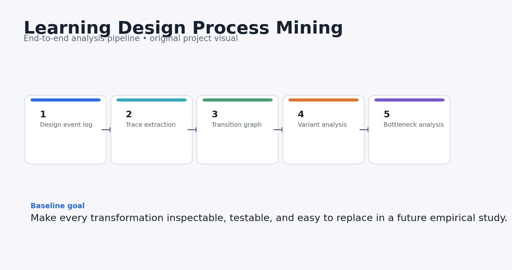
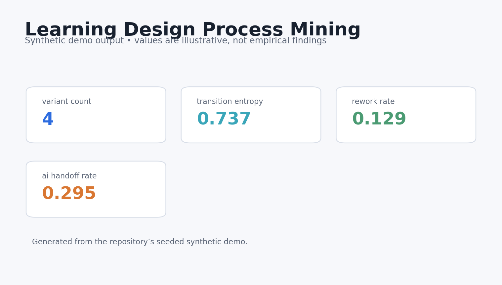
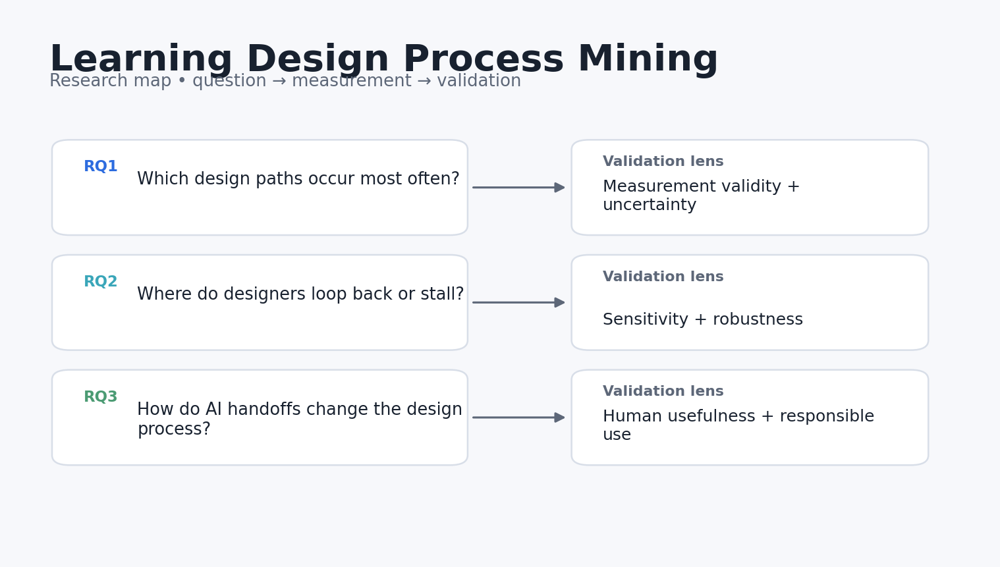

# Learning Design Process Mining

**Process-mining tools for studying how instructors and AI move from learning goals to activities, assessment, and revision.**

> Research prototype. All bundled data and results are synthetic demonstrations. Nothing in this repository should be interpreted as evidence about real learners, teachers, or institutions.



## Why this project exists

Learning design is usually documented as a final artifact, which hides the design process. This repo treats instructional design work as an event log so researchers can study iteration, bottlenecks, rework, and human–AI handoffs across the design lifecycle.

The engineering goal is simple: make the research logic inspectable. Every metric in the demo can be traced back to a small function, the demo data can be regenerated from a fixed seed, and the limitations are stated next to the claims rather than buried at the end.

## Research questions

1. Which design paths occur most often from objective-setting to release?
2. Where do designers loop back or stall?
3. How does AI assistance change iteration patterns without assuming that fewer steps are automatically better?

## What the repository does



The reference pipeline follows five stages:

1. **Design event log**
2. **Trace extraction**
3. **Transition graph**
4. **Variant analysis**
5. **Bottleneck analysis**

The current implementation is deliberately compact enough to audit. It is a foundation for a real study, not a theatrical “AI demo.”

## Core outputs

- `variant_count`
- `transition_entropy`
- `rework_rate`
- `median_stage_duration`
- `ai_handoff_rate`



The dashboard above is generated from **synthetic data** and is included only to show what the analysis surface looks like. It is not a reported empirical result.

## Quick start

```bash
python -m venv .venv
source .venv/bin/activate  # Windows: .venv\Scripts\activate
pip install -e .[dev]
python examples/demo.py
pytest -q
```

You can also use Docker:

```bash
docker build -t learning_design_process_mining .
docker run --rm learning_design_process_mining
```

## Repository structure

```text
learning_design_process_mining/
├── src/learning_design_process_mining/        # core implementation and synthetic-data generator
├── examples/demo.py        # end-to-end reproducible demo
├── tests/                  # executable unit tests
├── docs/                   # research design, data dictionary, references
│   └── images/             # original project diagrams and demo visualisations
├── results/                # synthetic demo outputs only
├── config/default.yaml
├── Dockerfile
├── Makefile
└── pyproject.toml
```

## Research design in one picture



The fuller design rationale is in [`docs/research_design.md`](docs/research_design.md), including constructs, assumptions, validation steps, and a proposed empirical extension.

## Reproducibility choices

- Synthetic generation uses a fixed random seed.
- The core metrics are implemented as small, testable functions.
- The demo writes machine-readable results into `results/`.
- CI runs the tests on every push and pull request.
- No API keys, proprietary datasets, or external model calls are required for the baseline.

## Responsible-use boundaries

- Process efficiency is not the same as design quality.
- The synthetic event taxonomy is intentionally small and should be adapted to the local design process.
- AI handoffs are logged as events; this repo does not claim they improve outcomes.

## Strong next experiments

- Import xAPI or workflow logs from real authoring environments.
- Add conformance checking against a chosen instructional-design model.
- Link process variants to expert review of final learning-design quality.

## References

See [`docs/references.md`](docs/references.md). The references are there to locate the project in current AIED, learning-analytics, human-centered AI, and instructional-design research. They do **not** imply endorsement or affiliation.

## Citation

If you build on this research prototype, use the metadata in [`CITATION.cff`](CITATION.cff).

## License

MIT for the code in this repository. Research data from future studies should use a separate data-governance and consent process.
